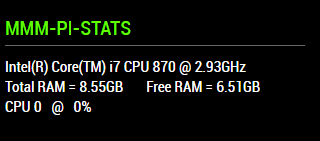

## MMM-Pi-Stats

Hopefully, a simple, low impact module for the Pi that retrieves the CPU name, amount of total
RAM and Free Ram, and identifies the CPU and the CPU load by percentage.

## Because it's simple

* You can set how often the data is retrieved (config option)

* You can set if the only the values change or the entire module fades in and out when data is retrieved.

* This should significantly reduce CPU load on your Pi. (config option)

* No CPU temperature. (I said it was simple)

* Annotated .css file included for coloring text and header.

## Examples

 

## Installation

* `git clone https://github.com/mykle1/MMM-Pi-Stats` into the `~/MagicMirror/modules` directory.

* `npm install` in your `~/MagicMirror/modules/MMM-Pi-Stats` directory.

## Config.js entry and options

    {
           disabled: false,
           module: 'MMM-Pi-Stats',
           position: 'top_left',
	       config: {
		   useHeader: true,           // true if you want a header. header = false means less load    
        	   header: "MMM-Pi-Stats",    // Any text you want. useHeader must be true
        	   maxWidth: "300px",
        	   animationSpeed: 0,         // 0 = no fade in and out. Only CPU load and Free RAM usage changes.
		   updateInterval: 15 * 1000, // How often the CPU and Free RAM is checked for load and usage.
	}
    },
	
## SpaceCowboysDude gets props once again.
